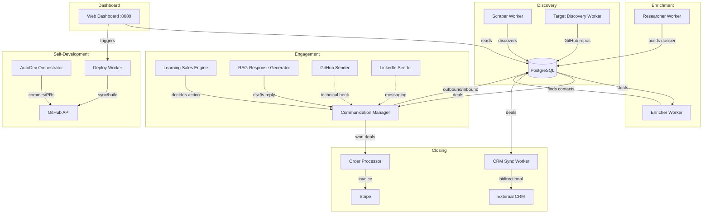

# Project Vision: TormentNexus Autonomous Sales Pipeline

## Ultimate Goal

The ultimate goal of this project is to create a fully autonomous, end-to-end B2B sales and lead generation pipeline for the [TormentNexus AI Hypervisor](https://github.com/robertpelloni/borg). The system is designed to identify, research, contact, persuade, and close deals with enterprise engineering departments without human intervention.

## Current State (v0.5.0)

TormentNexus is **v0.5.0: The Multi-Channel Integration Release**. All core workflows are functional with production-ready real-world integrations:

- **6 background workers** running concurrently (Scraper, Enricher, Researcher, CRM Sync, Communication, AutoDev)
- **7-state lead lifecycle** enforced atomically in PostgreSQL
- **Multi-channel outreach** via SMTP, GitHub Issue Comments, and LinkedIn messaging (scaffolded)
- **Dynamic CRM synchronization** with Salesforce and HubSpot using configurable field mappings
- **Self-improving outreach** via feedback loop from successful interactions
- **Autonomous code development** with CI-gated PR merging
- **Web dashboard** with real-time metrics, technical dossiers, and system health monitors

## Core Foundational Concepts

- **Autonomous Lead Generation:** Continuously scanning job boards (HN, LinkedIn) and GitHub activity to find high-intent prospects.
- **Hyper-Personalized Outreach:** Using deep technical research (crawling GitHub repos/blogs) to craft outreach that addresses the specific operational bottlenecks of target engineering teams.
- **Multi-Touch Cadence:** Automatically follows up with leads across different channels (Email -> GitHub -> LinkedIn) based on a defined schedule.
- **Autonomous Development:** The bot manages its own codebase via the `autodev` module, parsing its own `TODO.md` to implement features and gating merges on CI success.
- **Dynamic CRM Alignment:** Bidirectional sync that adapts to any enterprise CRM schema via environment-driven field mapping.
- **Technical Authority:** Leveraging RAG (Retrieval-Augmented Generation) over the TormentNexus codebase and documentation to answer complex technical questions from prospects.

## User-Satisfaction Design

- **High Signal, Low Noise:** The system prioritizes quality over quantity, ensuring that outreach is technical and value-oriented rather than spammy.
- **Transparency:** Clear tracking of lead states and interaction history in a centralized dashboard.
- **Safety & Guardrails:** Strict pricing floors and escalation protocols for non-standard requests to ensure business integrity.

## Architecture Overview

## Evolution Roadmap

### Near-Term (Phase 8): Intelligence & Autonomous Evolution
Replace hardcoded code generation with LLM-powered logic in `autodev`. Implement real technical blog/RSS ingestion for hiring signals. Add A/B testing for outreach templates to optimize conversion.

### Mid-Term (Phase 9): Security, Compliance & Scale
Harden for enterprise deployment with rate limiting, secrets encryption, and horizontal scalability. Implement GDPR compliance features (data export/deletion).

### Long-Term (Phase 10): Platform & Ecosystem
Package TormentNexus as a reusable SaaS platform. Add a plugin system for community-contributed sources, classifiers, and responders. Implement a marketplace for outreach strategies.
