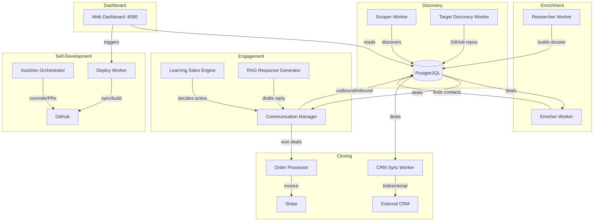

# Project Vision: TormentNexus Autonomous Sales Pipeline

## Ultimate Goal

The ultimate goal of this project is to create a fully autonomous, end-to-end B2B sales and lead generation pipeline for the [TormentNexus AI Hypervisor](https://github.com/robertpelloni/borg). The system is designed to identify, research, contact, persuade, and close deals with enterprise engineering departments without human intervention.

## Current State (v0.4.1)

TormentNexus is **production-ready** with a complete end-to-end pipeline from lead discovery through deal closure, billing, and even self-modification. All core workflows are functional with mock and real integrations:

- **6 background workers** running concurrently (Scraper, Enricher, Researcher, CRM Sync, Communication, AutoDev)
- **7-state lead lifecycle** enforced atomically in PostgreSQL
- **Self-improving outreach** via feedback loop from successful interactions
- **Autonomous code development** with CI-gated PR merging
- **Web dashboard** with real-time metrics, task board, and deployment controls
- **Docker + GitHub Actions CI/CD** for staging and production deployment

## Core Foundational Concepts

- **Autonomous Lead Generation:** Continuously scanning job boards, GitHub activity, and tech stacks to find high-intent prospects.
- **Hyper-Personalized Outreach:** Using deep technical research to craft outreach that addresses the specific operational bottlenecks of target engineering teams.
- **Autonomous Development:** The bot manages its own codebase via the `autodev` module, parsing its own `TODO.md` to implement features and gating merges on CI success.
- **Repository Governance:** Implements the "EXECUTIVE PROTOCOL" for robust repository synchronization and intelligent branch reconciliation.
- **Technical Authority:** Leveraging RAG (Retrieval-Augmented Generation) over the TormentNexus codebase and documentation to answer complex technical questions from prospects.
- **State Machine Orchestration:** A rigid, event-driven state machine that manages the entire lead lifecycle from discovery to closing.
- **Headless & Efficient:** Built in Go for high performance and scalability, using headless browsing for data extraction.
- **Continuous Prompt Optimization:** A self-improving feedback loop that utilizes successful interaction history to refine and optimize LLM outreach prompts.

## User-Satisfaction Design

- **High Signal, Low Noise:** The system prioritizes quality over quantity, ensuring that outreach is technical and value-oriented rather than spammy.
- **Transparency:** Clear tracking of lead states and interaction history in a centralized dashboard.
- **Safety & Guardrails:** Strict pricing floors and escalation protocols for non-standard requests to ensure business integrity.

## Architecture Overview

## Evolution Roadmap

### Near-Term (Phase 6): Production Hardening
The system works end-to-end but needs production-grade resilience: structured logging, connection pooling, graceful shutdown, retry/backoff, and comprehensive test coverage. All `os.Getenv()` calls should be consolidated into a typed config struct.

### Mid-Term (Phase 7–8): Real Integrations & Intelligence
Replace mock implementations with real providers (Apollo, SMTP, OpenAI/Anthropic, Salesforce). Enhance the autonomous development loop with LLM-powered code generation and PR feedback learning. Add multi-channel outreach with cadence management.

### Long-Term (Phase 9–10): Security, Scale & Platform
Harden for enterprise deployment with auth, rate limiting, GDPR compliance, and horizontal scalability. Package TormentNexus as a reusable SaaS platform with plugin extensibility and multi-tenant isolation.

## Key Metrics for Success

| Metric | Current | Target (Phase 8) | Target (Phase 10) |
|---|---|---|---|
| Lead Discovery Sources | 2 (mock) | 4+ (real) | 6+ (real + community) |
| Communication Channels | 1 (mock email) | 3 (SMTP, LinkedIn, GitHub) | 5+ (add SMS, Slack) |
| LLM Providers | 1 (mock) | 2+ (real with fallback) | 3+ (with auto-routing) |
| CRM Integrations | 2 (mock + REST) | 3+ (Salesforce, HubSpot) | 5+ (configurable) |
| Test Coverage | ~40% (unit only) | 80%+ (unit + integration) | 90%+ (full E2E) |
| Uptime SLA | Best-effort | 99.5% | 99.9% |
| Autonomous Code Quality | Template-based | LLM-powered + PR feedback | Self-validating + rollback |
