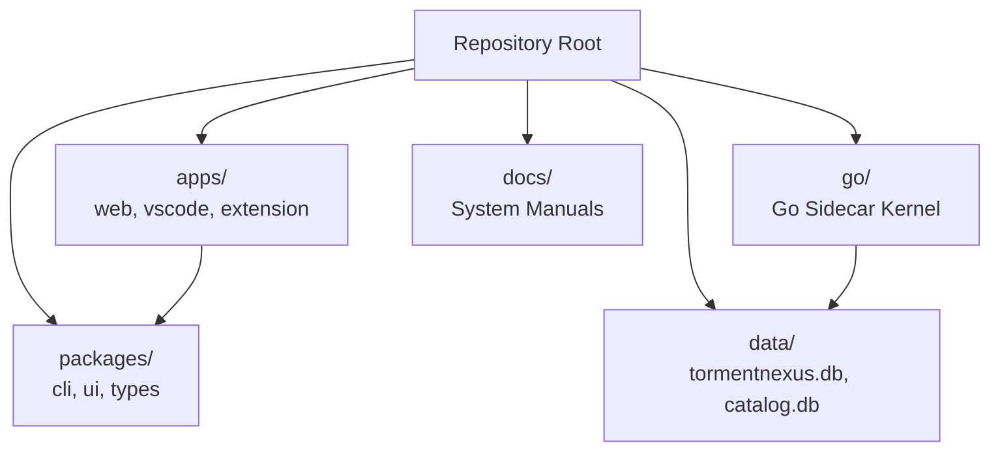

# Project Structure

This document outlines the organization and relationship of the codebases in the TormentNexus monorepo.

---

## 1. Top-Level Layout

The workspace is organized into key zones:

```text
/
├── apps/               # Standalone applications
│   ├── web/            # Next.js operator dashboard (port 3000)
│   ├── vscode/         # VS Code editor extension integration
│   └── tormentnexus-extension/ # Browser context extension app
├── go/                 # The Go-native sidecar control plane (Kernel backend)
│   ├── cmd/            # Entrypoints (cmd/tormentnexus)
│   └── internal/       # Core Go implementations (Memory, MCP, HTTP API, CodeExec)
├── packages/           # Shared TypeScript libraries
│   ├── types/          # Shared contracts
│   ├── ui/             # React presentation components
│   └── cli/            # Node.js CLI entrypoint
├── data/               # Persistent SQLite and LanceDB caches
├── archive/            # Retired subprojects or legacy ports (untracked)
└── docs/               # System documentation and diagrams
```

---

## 2. Directory Responsibilities

### [go/](file:///c:/Users/hyper/workspace/tormentnexus/go) (Go Sidecar Kernel)
The Go-native daemon process operates as the authoritative runtime and system supervisor:
* **`go/internal/supervisor/`**: Manages process lifecycles and monitors running sessions.
* **`go/internal/httpapi/`**: Serves endpoints for dashboard telemetry and control actions.
* **`go/internal/memorystore/`**: Integrates SQLite tables with LanceDB semantic vector indexes.

### [apps/](file:///c:/Users/hyper/workspace/tormentnexus/apps) (Applications)
* **`apps/web/`**: Next.js dashboard providing real-time process monitoring, memory visualization, and swarm status decks.

### [packages/](file:///c:/Users/hyper/workspace/tormentnexus/packages) (TypeScript Workspace)
* **`packages/ui/`**: Common UI elements shared between the extension and web dashboard.

### [archive/](file:///c:/Users/hyper/workspace/tormentnexus/archive) (Unmanaged Code)
* Kept strictly local to prevent losing historical crawler logic or datasets while keeping Git commits unpolluted.

---

## 3. Relationship & Flow Diagram


