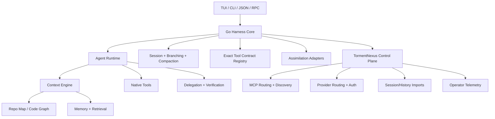

# Go Foundation Assimilation Design

## Design Summary
Build a **Go-native harness core** that uses:
- Go for runtime, orchestration, session control, and TUI integration.
- exact tool-contract manifests for model-facing compatibility,
- TormentNexus/TormentNexus as the default control-plane substrate,
- optional adapters for upstream-compatible behavior,
- a modular architecture that allows truthfully staged parity.

## Why Go
Go is the preferred foundation for this repository because it aligns with the product direction:
- easy static distribution,
- fast startup,
- simple concurrency for multi-agent orchestration,
- strong fit with Charmbracelet TUI tooling,
- natural adjacency to Ollama and other Go-native infrastructure,
- lower contributor friction than a Rust-first core.

## High-Level Architecture

## Package-Level Design

### 1. `foundation/pi`
Purpose: define the Pi-derived core harness contract in Go.

Current responsibilities:
- thinking levels
- message delivery modes
- transport selection
- tool execution modes
- run-event vocabulary
- built-in tool definitions
- default foundation spec
- native default tool execution (`read`, `write`, `edit`, `bash`)
- JSONL-backed session persistence and fork support
- evented runtime execution baseline

Future responsibilities:
- richer Go agent runtime
- extension host API
- prompt template runtime
- settings loader and migration
- JSON/RPC transport layer

### 2. `foundation/compat`
Purpose: preserve exact model-facing tool contracts.

Responsibilities:
- exact name/parameter/result contract storage
- maturity labeling (`planned`, `bridged`, `speced`, `native`, `verified`)
- source-specific compatibility catalogs
- later: contract tests against live/native implementations

### 3. `foundation/assimilation`
Purpose: keep the imported tool ecosystem visible and explicit.

Responsibilities:
- inventory of upstream systems
- strengths and unique traits
- assimilation strategy per source
- future: per-feature port map and parity scoreboard

### 4. `foundation/repomap`
Purpose: provide a native context-condensation layer inspired by Aider-style repo maps.

Responsibilities:
- scan and rank source files
- prioritize mentioned files and identifiers
- extract lightweight symbol summaries
- propagate lightweight cross-file reference influence as graph-ranking groundwork
- emit deterministic `<repo_map>` output for the harness
- provide the first step toward richer graph-based context ranking

### 5. `foundation/orchestration`
Purpose: provide reusable planning and execution-preparation primitives for higher-level orchestrators.

Responsibilities:
- infer task type from user prompts
- prepare provider execution plans
- optionally attach repo-map context
- generate deterministic orchestration steps for directors/supervisors
- generate webhook plans for queue/telemetry flows
- reduce placeholder orchestration logic in higher-level packages

### 6. `foundation/adapters`
Purpose: define and exercise the integration seam between the Go harness and TormentNexus/TormentNexus.

Responsibilities:
- expose TormentNexus memory/context status cleanly to the harness
- expose provider configuration/status cleanly to the harness
- expose early provider-route selection seams before full control-plane delegation
- expose MCP configuration visibility without duplicating MCP control-plane logic
- expose early MCP execution/routing seams before full control-plane delegation
- discover adjacent TormentNexus workspaces where available
- provide a stable adapter boundary before deeper provider/MCP routing integration
- supply reusable execution helpers for top-level CLI and HTTP surfaces
- support migration of provider- and MCP-related orchestration entrypoints onto shared adapter logic

### 7. TormentNexus integration boundary
TormentNexus should be treated as an external-but-local substrate.

Responsibilities retained by TormentNexus:
- provider routing and failover
- MCP aggregation and server lifecycle
- imported session and memory discovery
- operator control-plane APIs
- mesh and runtime status

Responsibilities owned by the new harness:
- model-facing UX
- exact tool contracts
- agent loop behavior
- session interaction model
- coding-agent specialization
- adapter consumption and presentation of TormentNexus/TormentNexus state
- migration of top-level HTTP/CLI surfaces onto foundation-backed execution paths

## Key Design Principles

### Principle 1: Behavior compatibility beats source similarity
We are not porting line-by-line. We are reproducing observable capability with a better internal design.

### Principle 2: Exact tool names are first-class data
Tool compatibility should not be implicit in code spread across packages. It should live in an explicit registry.

This now applies both to the foundation packages and to the top-level Go agent/tool registry surfaces: the top-level agent should consume per-tool schemas from the native compatibility registry instead of inventing a single placeholder schema.

### Principle 3: Native first, bridge second, never lie
Every imported feature should be labeled as:
- bridged via TormentNexus or another substrate,
- specified but not yet implemented,
- native,
- or verified.

### Principle 4: Keep the foundation small
Pi’s best lesson is that the core should stay narrow and extensible.

### Principle 5: Use upstream tools as references, not anchors
We should avoid creating a dependency graph where the new harness cannot stand without submodules.

## Compatibility Strategy

### Phase A: contract-first
Define exact tool and event contracts before rewriting behavior.

### Phase B: bridged parity
Route through TormentNexus/TormentNexus or local adapters where native parity is not ready.

### Phase C: native replacement
Replace bridged implementations one capability family at a time.

### Phase D: verified parity
Add contract and snapshot tests for each feature family.

## Current Foundation Artifacts Added in This Phase
- `foundation/pi/foundation.go`
- `foundation/pi/runtime*.go`
- `foundation/pi/session*.go`
- `foundation/pi/tools_native.go`
- `foundation/compat/*`
- `foundation/assimilation/*`
- `foundation/repomap/*`
- `foundation/orchestration/*`
- `foundation/adapters/*`
- `cmd/foundation.go`

## Baseline Risks Observed
- current repo contains stub implementations advertised as parity-complete but not actually complete,
- current Go test baseline fails in unrelated areas (`mcp`, `orchestrator`, fixture package),
- tool naming/contracts are not centrally defined in the existing Go code,
- current orchestration and TUI layers are not yet backed by a truthful native core.

## Recommended Next Technical Moves
1. Continue routing existing top-level placeholder command and orchestration surfaces to the new `foundation/pi` runtime.
2. Deepen `foundation/repomap` from lightweight graph groundwork toward fuller graph/LSP-aware ranking and port richer edit engines.
3. Expand `foundation/adapters` from status/config seams into real TormentNexus-backed provider routing and richer MCP execution adapters.
4. Continue migrating higher-level director/orchestrator logic onto `foundation/orchestration` primitives.
5. Expand verified snapshot-style contract tests for tool outputs plus CLI/HTTP behaviors.
6. Add verification, delegation, and background session services.
